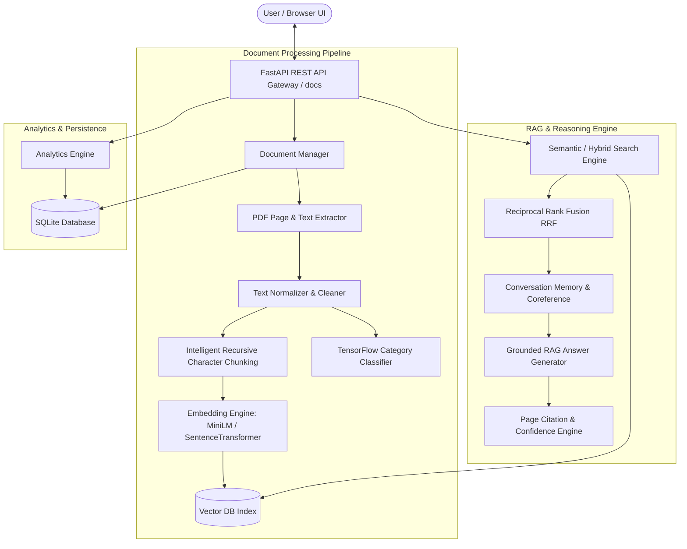

# AI Research & Knowledge Assistant

Production-grade, modular, and scalable **AI Research & Knowledge Assistant** backend application and interactive Web UI. The platform enables semantic retrieval across multi-page research documents, grounded Retrieval-Augmented Generation (RAG) with page citations, TensorFlow document classification across technical categories, side-by-side document comparison, multi-perspective summarization, session conversation memory, and real-time knowledge base analytics.

---

## 🏗️ Architecture Diagram



---

## 🛠️ Technology Stack

- **Backend Framework**: Python 3.14, FastAPI, Uvicorn, Pydantic v2, Pydantic-Settings
- **Document Processing**: PyPDF, ReportLab (for sample document generation)
- **Machine Learning & NLP**: TensorFlow / Keras, Scikit-Learn, SentenceTransformers (`all-MiniLM-L6-v2`)
- **Database & Persistence**: SQLite, SQLAlchemy ORM, Joblib, Keras SavedModel format
- **Frontend Dashboard**: HTML5, Modern Vanilla CSS (Dark Glassmorphism aesthetic), Vanilla JS (SPA architecture)
- **Testing & Verification**: PyTest, FastAPI TestClient

---

## 🚀 Quick Start & Setup Instructions

### 1. Environment Setup

Clone the repository and navigate to the project root directory:

```bash
cd ai_research_assistant
```

Create and activate a Python virtual environment:

```bash
# Using standard Python
python -m venv .venv
source .venv/bin/activate  # On Linux/macOS
.venv\Scripts\activate     # On Windows

# Or using uv (recommended for ultra-fast installs)
uv venv .venv
.venv\Scripts\activate
```

### 2. Install Dependencies

```bash
pip install -r requirements.txt
# Or via uv:
uv pip install -r requirements.txt
```

### 3. Generate Sample PDF Research Papers

Run the sample generator script to populate `sample_docs/` with realistic multi-page research papers across AI, ML, Computer Vision, NLP, and Cloud Computing:

```bash
python scripts/generate_samples.py
```

### 4. Train the TensorFlow Document Classifier Model

Execute the training script to build, evaluate, and persist the TensorFlow / Keras neural network model:

```bash
python scripts/train_classifier.py
```

### 5. Launch the Server

Start the FastAPI application with live reloading:

```bash
python -m uvicorn app.main:app --app-dir backend --reload --host 0.0.0.0 --port 8000
```

Access the interactive web dashboard and API documentation:
- **Web Application Dashboard**: [http://localhost:8000](http://localhost:8000)
- **Swagger Interactive API Documentation**: [http://localhost:8000/docs](http://localhost:8000/docs)
- **ReDoc API Documentation**: [http://localhost:8000/redoc](http://localhost:8000/redoc)

---

## ⚙️ Environment Variables

Copy `.env.example` to `.env` to configure settings:

```env
PROJECT_NAME="AI Research & Knowledge Assistant"
VERSION="1.0.0"
API_PREFIX="/api"

# Chunking & Embeddings
CHUNK_SIZE=800
CHUNK_OVERLAP=150
EMBEDDING_MODEL="sentence-transformers/all-MiniLM-L6-v2"

# LLM Provider Configuration ("local", "gemini", "openai")
LLM_PROVIDER="local"
GEMINI_API_KEY=""
OPENAI_API_KEY=""
```

---

## 📡 REST API Documentation Overview

| Method | Endpoint | Description |
| :--- | :--- | :--- |
| `POST` | `/api/documents/upload` | Upload PDF documents, process extraction, chunking, indexing, and TF classification |
| `GET` | `/api/documents` | List all uploaded documents with metadata |
| `GET` | `/api/documents/{id}` | Retrieve metadata for a specific document |
| `DELETE` | `/api/documents/{id}` | Purge document, DB records, and vector index |
| `POST` | `/api/documents/{id}/reprocess` | Re-run processing pipeline on document |
| `POST` | `/api/search` | Search indexed knowledge base using `semantic`, `keyword`, or `hybrid` modes |
| `POST` | `/api/assistant/chat` | AI Question Answering with page citations & session memory coreference |
| `POST` | `/api/assistant/compare` | Multi-document matrix comparison across methodologies, pros/cons, etc. |
| `POST` | `/api/assistant/summarize` | Generate Executive, Technical, Bullet Point, and Key Takeaway summaries |
| `POST` | `/api/assistant/classify/{id}` | Predict document category using trained TensorFlow classifier model |
| `GET` | `/api/analytics` | System knowledge base statistics and query insights |

---

## 💡 Key Design Decisions & Chunking Justification

### 1. Intelligent Recursive Character Chunking
Rather than arbitrary token length cuts, we implement **Intelligent Recursive Character Chunking** (`chunk_size=800`, `chunk_overlap=150`). The splitter respects document hierarchy by attempting splits in order of semantic significance:
1. Double newlines `\n\n` (Paragraph boundaries)
2. Single newlines `\n` (Structural section breaks)
3. Sentences `. ` (Grammatical boundaries)
4. Words ` ` (Lexical boundaries)

This ensures coherent concepts remain grouped together within individual chunks, maximizing vector embedding accuracy.

### 2. Multi-Mode Search Engine & Hybrid Reciprocal Rank Fusion (RRF)
- **Semantic Search**: Cosine similarity over dense vector embeddings (`all-MiniLM-L6-v2`). Excellent for understanding intent and conceptual similarity.
- **Keyword Search**: BM25 / TF-IDF sparse matching. Essential for exact technical acronyms, model names, and specific metrics.
- **Hybrid Search**: Combines rank scores from both dense and sparse retrievers using Reciprocal Rank Fusion ($RRF = \sum \frac{1}{k + r_i}$).

### 3. TensorFlow Document Classifier
A Keras Neural Network classifier (`Sequential` model with `TextVectorization` -> `Embedding` -> `GlobalAveragePooling1D` -> `Dense` layers) trained across 7 technical categories:
- *Artificial Intelligence*
- *Machine Learning*
- *Computer Vision*
- *Natural Language Processing*
- *Robotics*
- *Cyber Security*
- *Cloud Computing*

Model artifacts, tokenizers, and label mappings are persisted in `backend/models/`.

---

## 🧪 Running Automated Tests

Run the test suite using `pytest`:

```bash
pytest tests/ -v
```

Tests cover:
- Intelligent chunking size, overlap, and metadata preservation (`tests/test_chunking.py`)
- TensorFlow / Sklearn document classifier predictions (`tests/test_classifier.py`)
- Vector retrieval search modes & RAG QA grounded answers (`tests/test_rag_search.py`)
- FastAPI REST endpoints (`tests/test_api.py`)

---

## 🛡️ Assumptions & Limitations

1. **Document Formats**: Primary support is focused on standard text-based PDF documents. Scanned image-only PDFs require OCR preprocessing.
2. **Local Zero-Cost Fallback**: Out of the box, the system runs 100% locally without requiring external paid API keys. When external API keys (`GEMINI_API_KEY` or `OPENAI_API_KEY`) are provided in `.env`, the system can transparently proxy to cloud LLM providers.
